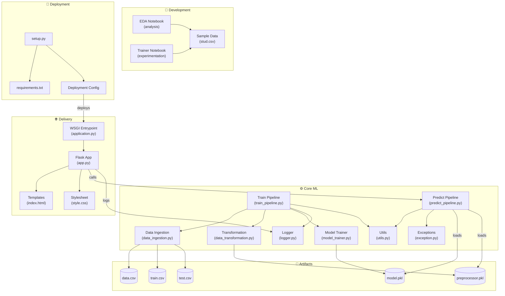

# 🎓 Student Score Predictor

An end-to-end Machine Learning web application that predicts a student's **Math score** based on demographic and academic indicators — gender, ethnicity, parental education level, lunch type, test preparation course, and reading/writing scores. The project follows a modular, production-style ML pipeline architecture (ingestion → transformation → training → prediction) and is deployed live on Render.

**🔗 Live Demo:** [student-score-predictor-qtik.onrender.com](https://student-score-predictor-qtik.onrender.com)

---

## 📌 Table of Contents

- [Overview](#-overview)
- [Tech Stack](#-tech-stack)
- [System Architecture](#-system-architecture)
- [Project Structure](#-project-structure)
- [Dataset](#-dataset)
- [Machine Learning Pipeline](#-machine-learning-pipeline)
- [Installation & Setup](#-installation--setup)
- [Usage](#-usage)
- [Deployment](#-deployment)
- [Results](#-results)
- [Future Improvements](#-future-improvements)
- [Author](#-author)

---

## 📖 Overview

This project predicts a student's **Math score** using a supervised regression model trained on the [Students Performance in Exams](https://www.kaggle.com/datasets/spscientist/students-performance-in-exams) dataset. It demonstrates a complete, modular ML engineering workflow rather than a single notebook script — covering data ingestion, preprocessing, model training, artifact persistence, and deployment behind a Flask web interface.

**Key objectives:**
- Build a reusable, modular ML pipeline (not just a notebook)
- Serialize and version preprocessing + model artifacts for reproducible inference
- Serve real-time predictions through a lightweight Flask web app
- Deploy the application to the cloud (Render) with a production WSGI server

---

## 🛠 Tech Stack

| Category | Technology |
|---|---|
| **Language** | Python 3 |
| **ML / Data** | scikit-learn, Pandas, NumPy |
| **Model** | Linear Regression (with `ColumnTransformer` preprocessing: `OneHotEncoder`, `StandardScaler`, `SimpleImputer`) |
| **Web Framework** | Flask |
| **WSGI Server** | Gunicorn / Waitress (production entrypoint) |
| **Frontend** | HTML5, CSS3 (Jinja2 templating) |
| **Serialization** | Pickle (`model.pkl`, `preprocessor.pkl`) |
| **Deployment** | Render (Elastic Beanstalk–style config also supported) |
| **Dev Tools** | Jupyter Notebook (EDA & experimentation) |
| **Version Control** | Git & GitHub |

---

## 🏗 System Architecture

The codebase is organized into four logical layers — **Development**, **Core ML**, **Delivery**, and **Deployment** — with a shared **Artifacts** store that decouples training from inference.



### How it works

1. **Development** — Exploratory analysis and pipeline prototyping happen in Jupyter notebooks against a sample dataset, before logic graduates into the production `src/` modules.
2. **Core ML** — `train_pipeline.py` orchestrates ingestion → transformation → training, persisting reusable artifacts. `predict_pipeline.py` loads those same artifacts at inference time, so training and serving never diverge.
3. **Artifacts** — A shared store (`artifacts/`) holds the raw dataset, train/test splits, the serialized `ColumnTransformer` (`preprocessor.pkl`), and the trained `LinearRegression` model (`model.pkl`).
4. **Delivery** — A Flask app (`app.py`), booted via a WSGI entrypoint (`application.py`), renders an HTML form, calls the predict pipeline on submission, and returns the predicted Math score.
5. **Deployment** — `setup.py` and `requirements.txt` package the app for distribution; a deployment config (Render / Elastic Beanstalk style) builds and serves it in production.

---

## 📁 Project Structure

```
ML_PROJECTS/
│
├── README.md                  # Project overview
├── setup.py                   # Packaging script
├── requirements.txt           # Project dependencies
├── application.py             # WSGI server entrypoint
├── app.py                      # Flask web entrypoint
│
├── notebook/
│   ├── EDA_notebook.ipynb     # Exploratory data analysis
│   └── Trainer_notebook.ipynb # Experiment / training notebook
│   └── stud.csv               # Sample source dataset
│
├── templates/
│   ├── index.html             # Home page view
│   └── home.html              # Prediction form view
│
├── static/
│   └── style.css              # UI styling
│
├── src/
│   ├── logger.py               # Centralized logging
│   ├── exception.py            # Custom exception handling
│   ├── utils.py                 # Shared helper functions
│   │
│   ├── components/
│   │   ├── data_ingestion.py        # Reads, splits & persists raw data
│   │   ├── data_transformation.py   # Feature preprocessing pipeline
│   │   └── model_trainer.py          # Model training & evaluation
│   │
│   └── pipeline/
│       ├── train_pipeline.py    # Orchestrates the training workflow
│       └── predict_pipeline.py  # Orchestrates inference on new data
│
└── artifacts/
    ├── data.csv                # Ingested raw dataset
    ├── train.csv               # Training split
    ├── test.csv                # Validation split
    ├── model.pkl                # Serialized trained model
    └── preprocessor.pkl         # Serialized feature transformer
```

---

## 📊 Dataset

The model is trained on the **Students Performance in Exams** dataset (1000 records), containing the following features:

| Feature | Type | Description |
|---|---|---|
| `gender` | Categorical | Student's gender |
| `race_ethnicity` | Categorical | Ethnic group (group A–E) |
| `parental_level_of_education` | Categorical | Highest education level of parents |
| `lunch` | Categorical | Standard or free/reduced lunch |
| `test_preparation_course` | Categorical | Completed or none |
| `reading_score` | Numerical | Score out of 100 |
| `writing_score` | Numerical | Score out of 100 |
| `math_score` | **Target** | Score out of 100 (predicted) |

The data is split into:
- `train.csv` — 800 records used for model fitting
- `test.csv` — 200 records used for evaluation

---

## 🔄 Machine Learning Pipeline

**1. Data Ingestion** (`data_ingestion.py`)
Reads the raw dataset, performs a train/test split, and writes `data.csv`, `train.csv`, and `test.csv` to the `artifacts/` directory.

**2. Data Transformation** (`data_transformation.py`)
Builds a `ColumnTransformer` pipeline:
- **Numerical features** (`reading_score`, `writing_score`): missing-value imputation (`SimpleImputer`) → standardization (`StandardScaler`)
- **Categorical features** (`gender`, `race_ethnicity`, `parental_level_of_education`, `lunch`, `test_preparation_course`): missing-value imputation → one-hot encoding (`OneHotEncoder`)

The fitted transformer is serialized to `preprocessor.pkl`.

**3. Model Training** (`model_trainer.py`)
Trains a **Linear Regression** model on the transformed features to predict `math_score`. The fitted model is serialized to `model.pkl`.

**4. Prediction Pipeline** (`predict_pipeline.py`)
Loads `preprocessor.pkl` and `model.pkl`, transforms new user input identically to training, and returns the predicted Math score to the Flask app.

---

## ⚙️ Installation & Setup

```bash
# 1. Clone the repository
git clone https://github.com/adilmirza975/ML_PROJECTS.git
cd ML_PROJECTS

# 2. Create and activate a virtual environment
python -m venv venv
source venv/bin/activate        # On Windows: venv\Scripts\activate

# 3. Install dependencies
pip install -r requirements.txt

# 4. (Optional) Re-run the training pipeline to regenerate artifacts
python src/pipeline/train_pipeline.py

# 5. Run the Flask app locally
python app.py
```

The app will be available at `http://127.0.0.1:5000`.

---

## 🚀 Usage

1. Open the web app (locally or via the [live demo](https://student-score-predictor-qtik.onrender.com)).
2. Fill in the student's gender, ethnicity, parental education, lunch type, test preparation status, and reading/writing scores.
3. Submit the form.
4. The app returns the **predicted Math score**.

---

## ☁️ Deployment

The application is deployed on **Render** as a Flask web service:

- `application.py` exposes the WSGI callable used by the production server.
- `requirements.txt` defines all runtime dependencies for the build.
- `setup.py` packages the project as an installable module.

**Live URL:** [https://student-score-predictor-qtik.onrender.com](https://student-score-predictor-qtik.onrender.com)

> The project structure also supports deployment via AWS Elastic Beanstalk using the same `setup.py` / `requirements.txt` packaging convention.

---

## 📈 Results

The trained Linear Regression model provides a baseline regression fit for Math score prediction using reading/writing scores and demographic features as predictors. (Update this section with your actual R² / RMSE evaluation metrics from `model_trainer.py`.)

| Metric | Value |
|---|---|
| Model | Linear Regression |
| R² Score | _add your value_ |
| RMSE | _add your value_ |

---

## 🔮 Future Improvements

- [ ] Benchmark additional regressors (Random Forest, XGBoost, Gradient Boosting) and select the best performer
- [ ] Add hyperparameter tuning (GridSearchCV / Optuna)
- [ ] Add CI/CD pipeline (GitHub Actions) for automated testing and deployment
- [ ] Containerize with Docker for environment-agnostic deployment
- [ ] Add input validation and error handling on the frontend form
- [ ] Add unit tests for pipeline components

---

## 👤 Author

**Adil Mirza**
🔗 [GitHub](https://github.com/adilmirza975)

---

### ⭐ If you found this project useful, consider giving it a star on GitHub!
